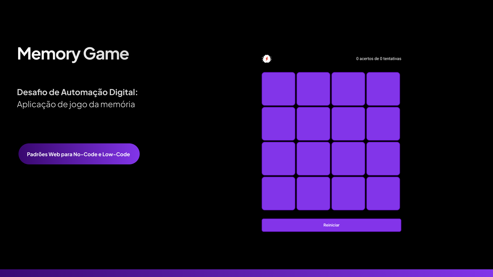

<div align="center">

# 🎮 Memory Game

### Um jogo de memória interativo e responsivo construído com JavaScript Vanilla

[](https://alissonmoraesdev.github.io/memory/)
[](LICENSE.md)
[](https://developer.mozilla.org/en-US/docs/Web/HTML)
[](https://developer.mozilla.org/en-US/docs/Web/CSS)
[](https://developer.mozilla.org/en-US/docs/Web/JavaScript)



[🎯 Live Demo](https://alissonmoraesdev.github.io/memory/) | [📖 Documentation](#-about) | [🚀 Getting Started](#-getting-started)

</div>

---

## 📋 Table of Contents

- [About](#-about)
- [Features](#-features)
- [Demo](#-demo)
- [Technologies](#-technologies)
- [Getting Started](#-getting-started)
- [Project Structure](#-project-structure)
- [Code Highlights](#-code-highlights)
- [Roadmap](#-roadmap)
- [Contributing](#-contributing)
- [License](#-license)
- [Contact](#-contact)

---

## 🎯 About

Memory Game é uma aplicação web interativa que desafia os jogadores a encontrarem pares de cartas correspondentes. O projeto demonstra proficiência em manipulação do DOM, event handling, e design responsivo utilizando apenas **JavaScript Vanilla** - sem frameworks ou bibliotecas externas.

### 🎓 Learning Objectives

Este projeto foi desenvolvido para demonstrar:

- ✅ Manipulação avançada do DOM
- ✅ Event handling e delegação de eventos
- ✅ Algoritmos de embaralhamento (Fisher-Yates)
- ✅ State management em JavaScript puro
- ✅ Design responsivo e mobile-first
- ✅ CSS Grid e Flexbox layouts
- ✅ Boas práticas de código limpo e manutenível

---

## ✨ Features

- 🎴 **Grid Dinâmico**: Sistema de cartas totalmente dinâmico e customizável
- ⏱️ **Cronômetro**: Timer em tempo real para trackear performance
- 🏆 **Sistema de Pontuação**: Contador de movimentos e melhor score
- 📱 **Responsivo**: Adaptável para desktop, tablet e mobile
- 🎨 **Animações Suaves**: Transições CSS3 para melhor UX
- 💾 **Local Storage**: Persistência de dados do melhor score
- ♿ **Acessível**: Suporte a navegação por teclado e screen readers

---

## 🎬 Demo

### Desktop View


### Mobile View


**🔗 Try it live:** [alissonmoraesdev.github.io/memory](https://alissonmoraesdev.github.io/memory/)

---

## 🛠️ Technologies

### Core Stack

| Technology                                                                                               | Purpose             | Documentation                                                       |
| -------------------------------------------------------------------------------------------------------- | ------------------- | ------------------------------------------------------------------- |
|                 | Estrutura semântica | [MDN Docs](https://developer.mozilla.org/en-US/docs/Web/HTML)       |
|                    | Estilos e animações | [MDN Docs](https://developer.mozilla.org/en-US/docs/Web/CSS)        |
|  | Lógica da aplicação | [MDN Docs](https://developer.mozilla.org/en-US/docs/Web/JavaScript) |

### Additional Resources

- **Font:** [Roboto](https://fonts.google.com/specimen/Roboto) - Google Fonts
- **Icons:** Font Awesome / Custom SVG
- **Hosting:** GitHub Pages

---

## 🚀 Getting Started

### Prerequisites

Você só precisa de um navegador moderno! Nenhuma dependência externa é necessária.

### Installation

1. **Clone o repositório**

```bash
   git clone https://github.com/alissonmoraesdev/memory.git
```

2. **Navegue até o diretório**

```bash
   cd memory
```

3. **Abra o projeto**

```bash
   # Opção 1: Abra diretamente no navegador
   open index.html

   # Opção 2: Use um servidor local (recomendado)
   # Com Python 3
   python -m http.server 8000

   # Com Node.js (npx)
   npx serve
```

4. **Acesse no navegador**

```
   http://localhost:8000
```

---

## 📁 Project Structure

```
memory/
├── .github/
│   ├── preview.png
│   └── LICENSE.md
├── assets/
│   ├── css/
│   │   ├── styles.css
│   │   └── responsive.css
│   ├── js/
│   │   ├── game.js
│   │   ├── cards.js
│   │   └── utils.js
│   └── images/
│       └── cards/
├── index.html
└── README.md
```

### Key Files

| File                        | Description                            |
| --------------------------- | -------------------------------------- |
| `index.html`                | Estrutura principal e markup semântico |
| `assets/css/styles.css`     | Estilos principais e tema              |
| `assets/css/responsive.css` | Media queries e adaptações             |
| `assets/js/game.js`         | Lógica principal do jogo               |
| `assets/js/cards.js`        | Gerenciamento de cartas                |
| `assets/js/utils.js`        | Funções auxiliares                     |

---

## 💻 Code Highlights

### Fisher-Yates Shuffle Algorithm

```javascript
/**
 * Implementação do algoritmo Fisher-Yates para embaralhamento imparcial
 * Complexidade: O(n)
 */
function shuffleArray(array) {
  const shuffled = [...array]
  for (let i = shuffled.length - 1; i > 0; i--) {
    const j = Math.floor(Math.random() * (i + 1))
    ;[shuffled[i], shuffled[j]] = [shuffled[j], shuffled[i]]
  }
  return shuffled
}
```

### Event Delegation Pattern

```javascript
/**
 * Usa event delegation para performance otimizada
 * Evita múltiplos listeners em cada carta
 */
gameBoard.addEventListener('click', e => {
  const card = e.target.closest('.card')
  if (!card || card.classList.contains('flipped')) return

  handleCardClick(card)
})
```

---

## 🗺️ Roadmap

### Implemented ✅

- [x] Core game mechanics
- [x] Timer e score system
- [x] Responsive design
- [x] Local storage integration
- [x] Smooth animations

### Planned 🎯

- [ ] **Difficulty levels** (Easy, Medium, Hard)
- [ ] **Themes system** (Dark mode, Custom themes)
- [ ] **Multiplayer mode** via WebSockets
- [ ] **Sound effects** e background music
- [ ] **Leaderboard** global com Firebase
- [ ] **Progressive Web App** (PWA) support
- [ ] **Unit tests** com Jest
- [ ] **Internationalization** (i18n)

---

## 🤝 Contributing

Contribuições são muito bem-vindas! Se você tem sugestões, bug reports ou quer adicionar features:

1. Fork o projeto
2. Crie sua feature branch (`git checkout -b feature/AmazingFeature`)
3. Commit suas mudanças (`git commit -m 'Add some AmazingFeature'`)
4. Push para a branch (`git push origin feature/AmazingFeature`)
5. Abra um Pull Request

### Contribution Guidelines

- Siga o estilo de código existente
- Adicione comentários para lógica complexa
- Teste em múltiplos navegadores
- Atualize a documentação se necessário

---

## 📄 License

Este projeto está sob a licença MIT - veja o arquivo [LICENSE.md](.github/LICENSE.md) para detalhes.

---

## 📬 Contact

**Alisson Moraes**

[](https://linkedin.com/in/alissonmoraesdev)
[](https://github.com/alissonmoraesdev)
[](https://seu-portfolio.com)
[](mailto:alissonmoraesdev@gmail.com)

---

<div align="center">

### ⭐ Se você gostou deste projeto, considere dar uma estrela!

**Made with ❤️ and JavaScript**

[⬆ Back to top](#-memory-game)

</div>
